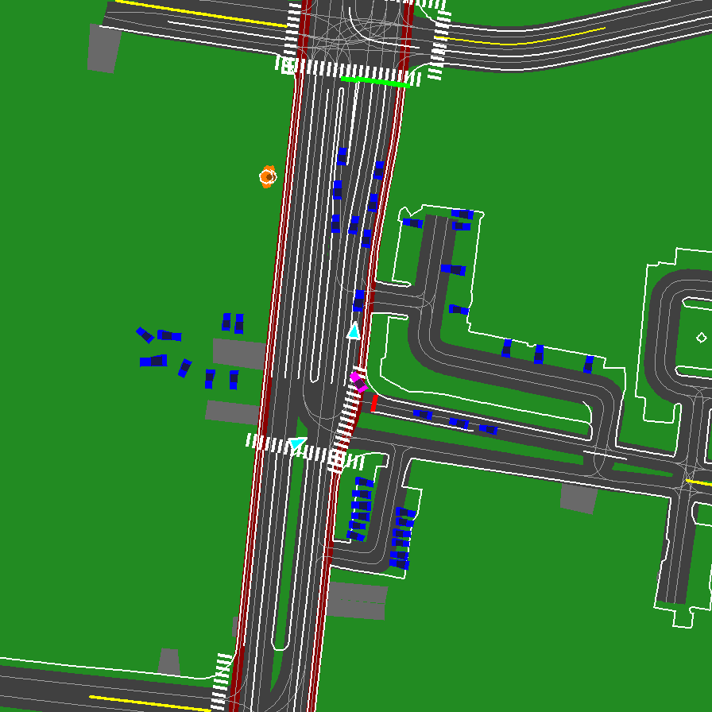

# The Causal Scrutinizer: A VLM Framework for Auditing AV Reasoning

**Status:** Active Research (Production Run In Progress)
**Author:** Antonio Guillen-Perez, Ph.D.
**Contact:** antonio_algaida at hotmail.com

---

*
A challenging intersection scenario from the Waymo Open Motion Dataset, visualized by our V6 Renderer.
*

---

## 1. Project Mission

The mission of the "Causal Scrutinizer" is to develop and validate a novel, open-source framework for auditing the "common sense" and **causal reasoning** of autonomous vehicle (AV) planners. Traditional AV safety metrics can identify *what* happened in a long-tail event (e.g., a hard brake), but they fail to explain the *why*. This "explainability gap" is a critical barrier to building a defensible safety case.

Our framework addresses this gap by leveraging a state-of-the-art **Vision-Language Model (VLM)** as a scalable, programmatic **"expert safety auditor."** For any given long-tail scenario, the system automatically generates a rich, expert-level, natural language causal audit, providing deep insights into the reasoning capabilities of an AV's planning system.

This work is directly inspired by the critical need for scalable, human-aligned evaluation metrics, as highlighted in recent industry benchmarks like Waymo's WOD-E2E. Our framework is designed to **automate and scale** the type of expert-level analysis currently performed by manual human raters.

---

## 2. The "Ultimate RAG" Methodology

Our journey revealed that even powerful, frontier-level VLMs are not reliable geometry engines and are prone to perceptual and factual hallucinations. To solve this, we architected a complete, end-to-end pipeline (`Mine -> Reason -> Audit`) built on a novel **"Ultimate RAG" (Retrieval-Augmented Generation)** methodology.

This system combines three key innovations to transform a general-purpose VLM into a specialized and reliable safety auditor:

### 1. **Simulation-Grade Visuals (The "World")**
A custom, `pygame`-based **`ScenarioRendererV6`** translates raw, vectorized Waymo data into an unambiguous, ego-centric, SUMO-inspired visual language. By using clear symbols (e.g., pentagonal stop signs), semantic colors, and an ego-centric "up-is-forward" perspective, we eliminate the visual ambiguity that is a root cause of VLM perceptual failures.

### 2. **Deterministic Geometry Engine (The "Ground Truth")**
A suite of robust, deterministic geometric functions (`check_for_path_conflict`, `get_top_k_threats`, etc.) serves as our own ground-truth "perception system." This engine performs all complex spatial-temporal calculations (e.g., collision checks, threat prioritization) in Python, freeing the VLM to focus on its core competency: causal reasoning.

### 3. **Agentic Prompting (The "Auditor")**
A state-of-the-art **`V22 - Deep Reflexion`** agentic prompt that injects the factual conclusions from our geometry engine directly into the VLM's context for each frame. This "Ultimate RAG" approach anchors the model's reasoning in verifiable facts. The prompt guides the model through a sophisticated Chain-of-Thought process, forcing it to synthesize the facts and visuals into a final, expert-level causal audit.

---

## 3. Comparative VLM Analysis

A core contribution of this research was a rigorous, head-to-head comparison of multiple state-of-the-art VLMs on our most challenging test case. This analysis revealed critical differences in their capabilities:
*   **Qwen-30B:** Suffered from catastrophic object hallucinations (inventing a "red truck").
*   **Gemma-27B:** Was perceptually stable but demonstrated a powerful narrative bias, ignoring the primary geometric risk to focus on a more "story-like" but less critical event.
*   **Kimi-VL-A3B (MoE):** Was the only model to successfully overcome all failure modes. It correctly synthesized all ground-truth data, identified the true primary risk, and produced a flawless causal analysis. Its superior performance and efficiency made it the definitive choice for this project.

---

## 4. Current Status & Next Steps

The core research and development phase for the methodology is **complete**. The full pipeline has been architected, implemented, and validated.

-   [x] V6 "Simulation-Grade" Renderer (Complete)
-   [x] Deterministic Geometry Engine (Complete)
-   [x] V22 "Deep Reflexion" Agentic Prompt (Complete)
-   [x] Comparative VLM Analysis (Qwen vs. Gemma vs. Kimi-VL) (Complete)
-   [ ] **Production Run:** Generation of the full "Causal Rationale Dataset" on our mined batch of 100+ critical scenarios.
-   [ ] **Final Analysis:** Creation of the final analysis notebook and plots from the generated dataset.
-   [ ] **Paper Release:** Pre-print publication to arXiv.

The full dataset, analysis notebooks, and pre-print will be released here upon completion of the production run.

---

## 5. Repository Structure

*   `/src/`: The core Python source code for the entire pipeline.
    *   `/data_processing/`: Scripts for parsing Waymo data and scoring scenarios.
    *   `/rendering/`: The `ScenarioRendererV6` engine.
    *   `/reasoning/`: The prompt templates and `geometry.py` engine.
    *   `/audit/`: Scripts for the final "Audit Engine" (Stage 3).
*   `/notebooks/`: A sequence of Jupyter notebooks that document the project's journey, from the initial feasibility study to the final analysis.
*   `/outputs/`: Directory for all generated assets (rendered GIFs, mined scenario lists, and the final causal rationale dataset).
*   `/configs/`: The central `main_config.yaml` file for controlling the pipeline.
