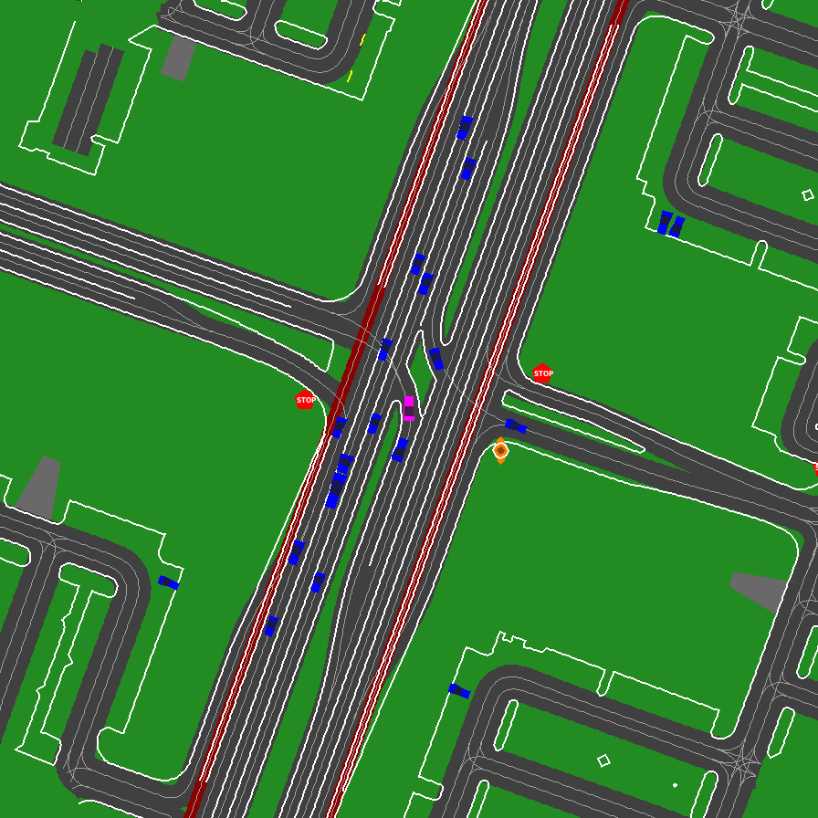
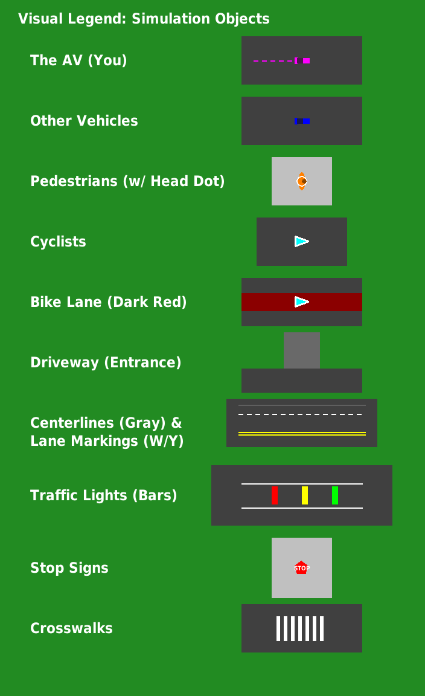
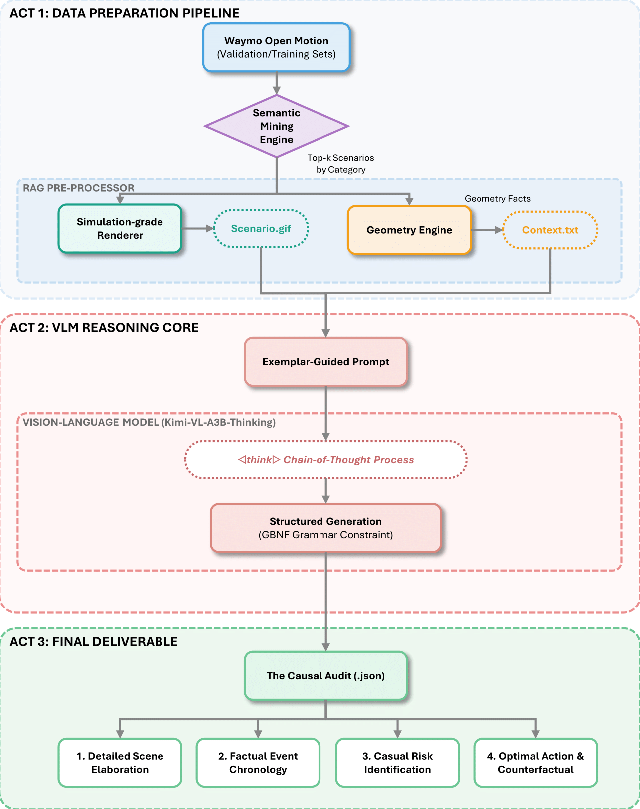

# The Causal Scrutinizer: A VLM-Powered Framework for Auditing AV Reasoning

<p align="center">
  This repository contains the official implementation of "The Causal Scrutinizer," a novel framework for using Vision-Language Models (VLMs) to perform scalable, explainable, causal safety audits of autonomous vehicle planners in long-tail scenarios.
</p>

<p align="center">
  <!-- TODO: Update with your ArXiv paper ID once submitted -->
  <a href="#" target="_blank">
    
  </a>
  <a href="LICENSE">
    
  </a>
  <a href="https://www.python.org/downloads/release/python-310/">
    
  </a>
  <a href="https://pytorch.org/">
    
  </a>
</p>

<p align="center">
  A project by <strong>Antonio Guillen-Perez</strong> | 
  <a href="https://antonioalgaida.github.io/" target="_blank"><strong>Portfolio</strong></a> | 
  <a href="https://www.linkedin.com/in/antonioguillenperez/" target="_blank"><strong>LinkedIn</strong></a> | 
  <a href="https://scholar.google.com/citations?user=BFS6jXwAAAAJ" target="_blank"><strong>Google Scholar</strong></a>
</p>

- [The Causal Scrutinizer: A VLM-Powered Framework for Auditing AV Reasoning](#the-causal-scrutinizer-a-vlm-powered-framework-for-auditing-av-reasoning)
  - [1. Key Result](#1-key-result)
  - [2. Project Mission](#2-project-mission)
  - [3. Technical Approach](#3-technical-approach)
  - [4. Repository Structure](#4-repository-structure)
  - [5. Setup and Installation](#5-setup-and-installation)
  - [6. The End-to-End Auditing Pipeline](#6-the-end-to-end-auditing-pipeline)
      - [Step 1: Mine for Critical Scenarios](#step-1-mine-for-critical-scenarios)
      - [Step 2: Preprocess Scenarios (Render GIFs)](#step-2-preprocess-scenarios-render-gifs)
      - [Step 3: Generate Causal Rationales](#step-3-generate-causal-rationales)
      - [Step 4 (Optional): Run a Single Scenario Audit](#step-4-optional-run-a-single-scenario-audit)
  - [7. Analysis and Visualization](#7-analysis-and-visualization)
  - [8. Citation](#8-citation)

---


## 1. Key Result
This project successfully demonstrates that a Vision-Language Model, when guided by a robust, "fact-grounded" prompting framework, can act as a scalable, expert-level safety auditor. It can analyze complex, long-tail driving scenarios and produce detailed, human-like causal explanations that identify the root causes of risk and recommend safe, defensive actions.

<p align="center">
  
  
</p>
<p align="center">
  <em><b>Figure 1: The Input.</b> The framework takes raw Waymo data and converts it into a clean, unambiguous, "simulation-grade" visual representation (left), which is provided to the VLM alongside a clear visual legend (right).</em>
</p>

<p align="center">
  <em><b>Figure 2: The Output.</b> For the scenario above, the VLM generates a complete, four-step causal audit, correctly identifying the path conflict and recommending a safe, defensive action. (See the full JSON output in the <a href="examples/final_audits/">examples</a> directory).</em>
</p>

## 2. Project Mission
The validation of autonomous vehicles is plagued by two core challenges: the **"long tail"** of rare, dangerous events and the **"explainability gap"** of black-box models. Traditional metrics can tell us *if* a planner failed, but not *why*. As highlighted by recent industry research (e.g., Waymo's WOD-E2E benchmark), there is a critical need for new, human-aligned methodologies that can audit an AV's "common sense" reasoning at scale.

This project's mission is to solve this problem by introducing the "Causal Scrutinizer," a novel framework that uses a VLM as a programmatic **"expert driving instructor."** Instead of relying on slow and expensive manual human rating, our system automatically audits an AV planner's behavior, generating a rich, explainable, natural language "causal rationale" for each long-tail event.

## 3. Technical Approach
Our system is a multi-stage pipeline designed to overcome the known failure modes of VLMs (hallucination, salience failure) and transform them into reliable analytical tools. We call this the **"Ultimate RAG" (Retrieval-Augmented Generation) Agentic System**.

1.  **Semantic Mining:** We first process the entire Waymo Open Motion Dataset validation set, using a suite of expert-driven heuristics to find a "Golden Batch" of causally complex scenarios (e.g., `VRU_Crossing`, `Cut_In`, `Hard_Braking`).
2.  **Simulation-Grade Rendering (`ScenarioRendererV6`):** We take the raw, vectorized data for each scenario and render it into a clean, unambiguous, ego-centric GIF. Inspired by professional tools like SUMO, this renderer uses a "simulation-grade" visual language with distinct sprites and symbols to eliminate the perceptual ambiguity that causes VLM hallucinations.
3.  **Deterministic Geometry Engine (`geometry.py`):** Before prompting the VLM, we perform a deterministic, frame-by-frame analysis in Python to calculate the ground truth. This includes checking for path conflicts, identifying the AV's relevant traffic light, and ranking other agents by a threat score.
4.  **"Ultimate RAG" Prompting:** We provide the VLM with all the facts. For each keyframe, the prompt is augmented with the visual GIF, the ground-truth data from our geometry engine, and a clear visual legend.
5.  **Expert Persona & Deep Reasoning:** The final prompt instructs the VLM to act as "Scrutinizer-AI." It uses a "Deep Reasoning Directive" to encourage the model to "think step-by-step" (Chain-of-Thought) and a "Few-Shot" exemplar to show it exactly what a high-quality, detailed causal audit looks like. This combination of data and instruction forces the model to act as a pure Causal Reasoner, synthesizing the facts we provide into an expert-level narrative.

<p align="center">
  
</p>

*<p align="center"><b>Figure 3: System Architecture.</b> A deterministic geometry engine provides ground-truth facts to a VLM, which synthesizes them with visual evidence to produce a causal audit.</p>*

## 4. Repository Structure
```
CausalScrutinizer/
├── configs/              # Main configuration file for the project
├── data/                 # (Gitignored) Contains mined scenario ID lists
├── environment.yml       # Conda environment for reproducibility
├── examples/             # Curated examples of inputs and outputs
├── notebooks/            # Jupyter notebooks for analysis and visualization
├── outputs/              # (Gitignored) Local directory for all generated files
├── prompts/              # GBNF grammars for constrained generation
├── requirements.txt      # Pip requirements file
├── scripts/              # Main, executable scripts for running the pipeline
│   ├── preprocess_scenarios.py
│   └── run_production_audit.py
├── src/                  # Core library of reusable Python modules
│   ├── data_processing/
│   ├── mining/
│   ├── reasoning/
│   ├── rendering/
│   └── utils/
└── README.md
```

## 5. Setup and Installation

1.  **Clone the repository:**
    ```bash
    git clone https://github.com/AntonioAlgaida/CausalScrutinizer.git
    cd CausalScrutinizer
    ```

2.  **Create and activate the Conda environment:**
    This project requires a specific Conda environment to ensure all dependencies, especially for GPU support, are correctly installed.
    ```bash
    conda env create -f environment.yml
    conda activate causal_scrutinizer
    ```

3.  **Setup for `llama-cpp-python`:**
    Before installing pip packages, you must set the correct flags to force `llama-cpp-python` to compile with GPU support.
    ```bash
    export CMAKE_ARGS="-DGGML_CUDA=ON"
    export FORCE_CMAKE=1
    ```

4.  **Install Pip dependencies:**
    Finally, install the remaining packages using pip.
    ```bash
    pip install -r requirements.txt
    ```

5.  **Setup Local LLM Server (LM Studio):**
    This project uses [LM Studio](https://lmstudio.ai/) to serve the VLM.
    - Download and install LM Studio.
    - In the app, search for and download a GGUF model (e.g., `Kimi-VL-A3B-Thinking-2506-Q8_0.gguf`).
    - Go to the "Local Server" tab (the `<->` icon) and start the server.

## 6. The End-to-End Auditing Pipeline

This is the main workflow for running the project. All commands should be run from the root of the repository.

#### Step 1: Mine for Critical Scenarios
This script runs our "Semantic Sieve" on the pre-processed Waymo NPZ data to produce the final `golden_batch_semantic.csv` file.
> **Note:** This is a long-running, CPU-intensive process.
```bash
# Activate the environment
conda activate causal_scrutinizer

# Run the semantic miner
python -m src.mining.mine_semantic_scenarios
# When prompted, choose 'validation' or 'training'
```

#### Step 2: Preprocess Scenarios (Render GIFs)
This script takes the output from the miner and runs our `ScenarioRendererV6` in parallel to generate the GIF for each critical scenario.
```bash
python scripts/preprocess_scenarios.py
```

#### Step 3: Generate Causal Rationales
This is the main production script. It iterates through the preprocessed scenarios and calls the VLM to generate the final causal audit for each one, saving the result as a `.json` file.
> **Prerequisite:** Ensure your LM Studio server is running.
```bash
python scripts/run_production_audit.py
```
This will populate the `outputs/causal_rationale_dataset/` directory.

#### Step 4 (Optional): Run a Single Scenario Audit
To debug or test the full pipeline on a single scenario, use this script.
```bash
python scripts/run_single_scenario_audit.py [OPTIONAL_SCENARIO_ID]
```

## 7. Analysis and Visualization
The `notebooks/05_final_analysis_and_plots.ipynb` notebook contains a complete, interactive dashboard for exploring the results. It allows you to:
-   Select any scenario from the final dataset.
-   View the rendered GIF, the VLM's full rationale, and the AV's telemetry data side-by-side.
-   Generate quantitative plots, such as the distribution of recommended safety actions.

## 8. Citation
If you find this project or its methodology useful for your research, please consider citing:
```bibtex
@misc{guillen2025causalscrutinizer,
      title={The Causal Scrutinizer: A VLM-Powered Framework for Auditing AV Reasoning}, 
      author={Antonio Guillen-Perez},
      year={2025},
      eprint={25XX.XXXXX},
      archivePrefix={arXiv}
}
```